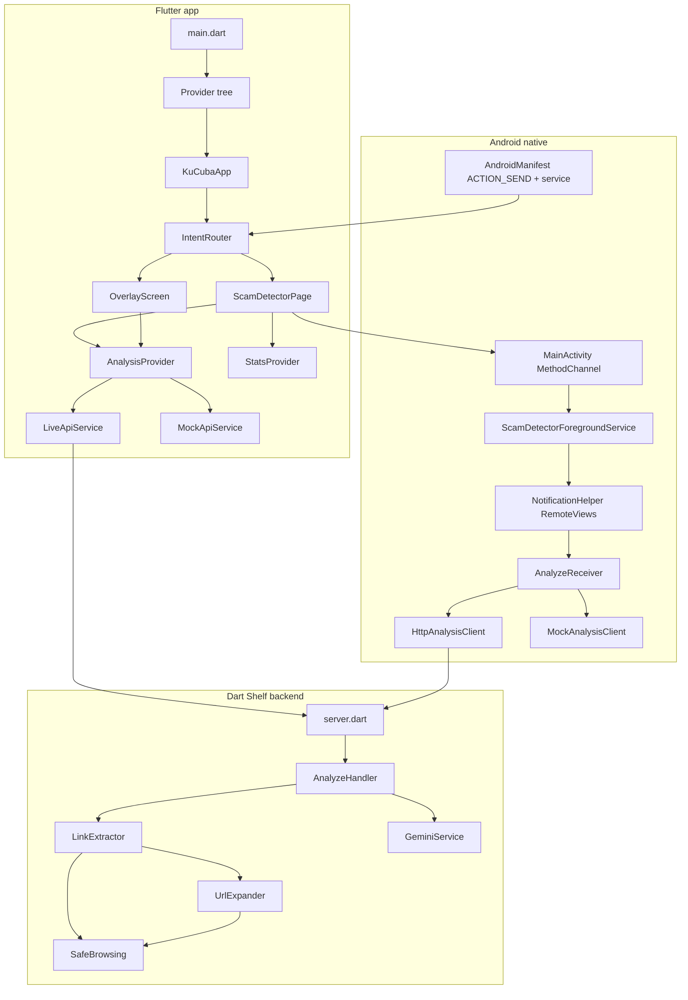
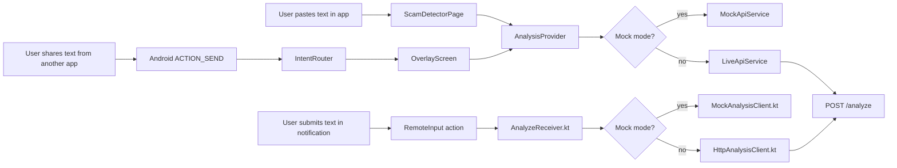
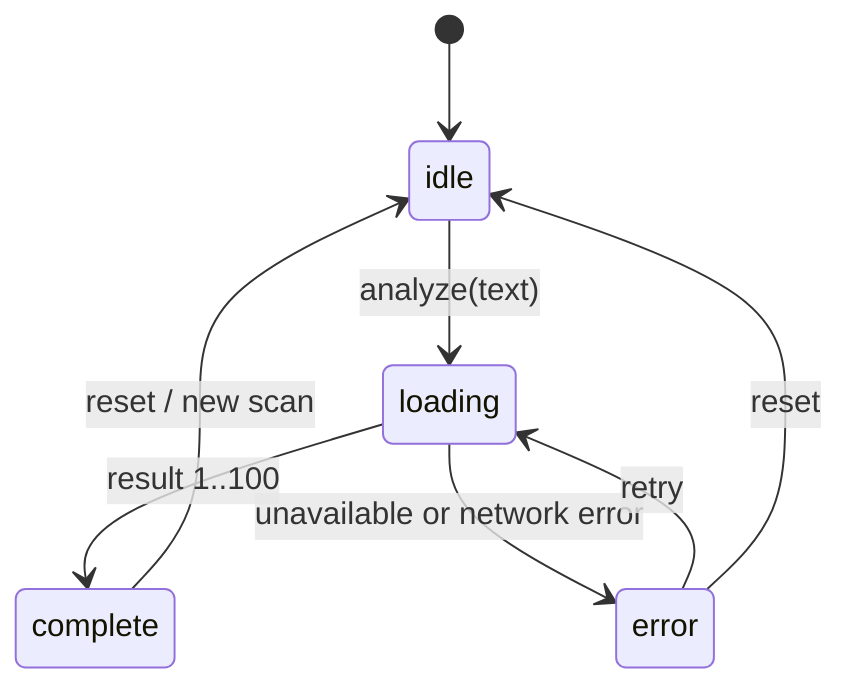
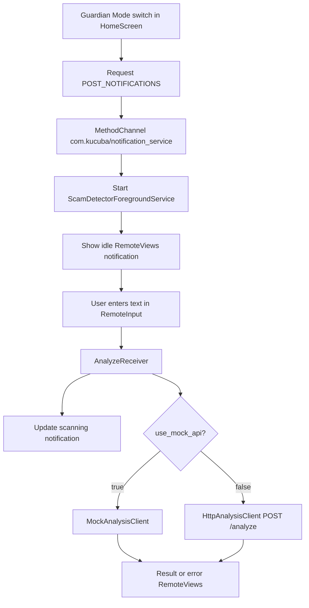

# Architecture Diagrams

**Project:** Eternal Guardian  
**Status:** Current implementation  
**Last updated:** 2026-05-24

## 1. Application Module Map

```text
lib/
|-- main.dart
|   `-- creates providers and launches KuCubaApp
|-- app.dart
|   `-- MaterialApp with Bank Islam theme and IntentRouter home
|-- config/
|   `-- app_config.dart
|-- models/
|   |-- analysis_result.dart
|   `-- scam_demo_models.dart
|-- providers/
|   |-- analysis_provider.dart
|   `-- stats_provider.dart
|-- screens/
|   |-- home_screen.dart
|   |-- intent_router.dart
|   `-- overlay_screen.dart
|-- services/
|   |-- api_service.dart
|   |-- mock_api_service.dart
|   `-- notification_service_controller.dart
|-- theme/
|   |-- app_colors.dart
|   |-- app_typography.dart
|   `-- bank_islam_theme.dart
`-- widgets/
    |-- analog_meter.dart
    |-- analysis_message_card.dart
    |-- analyze_button.dart
    |-- error_banner.dart
    |-- risk_badge.dart
    |-- risk_utils.dart
    |-- scam_widgets.dart
    |-- skeleton_meter_placeholder.dart
    `-- text_input_area.dart
```

## 2. Android Native Module Map

```text
android/app/src/main/
|-- AndroidManifest.xml
|-- kotlin/com/kucuba/eternal_guardian/
|   |-- MainActivity.kt
|   |-- ScamDetectorForegroundService.kt
|   |-- AnalyzeReceiver.kt
|   |-- NotificationHelper.kt
|   |-- HttpAnalysisClient.kt
|   `-- MockAnalysisClient.kt
`-- res/layout/
    |-- notification_idle.xml
    |-- notification_scanning.xml
    |-- notification_result.xml
    `-- notification_status.xml
```

## 3. Backend Module Map

```text
backend/
|-- bin/
|   |-- server.dart
|   `-- run_tests.dart
`-- lib/
    |-- handlers/
    |   `-- analyze_handler.dart
    |-- models/
    |   `-- analysis_result.dart
    `-- services/
        |-- gemini_service.dart
        |-- link_extractor.dart
        |-- safe_browsing.dart
        `-- url_expander.dart
```

## 4. Runtime Architecture



## 5. Client Entry Points



## 6. Backend Sequence

```mermaid
sequenceDiagram
  participant Client as Flutter/Kotlin client
  participant Server as Shelf POST /analyze
  participant Handler as AnalyzeHandler
  participant Links as LinkExtractor
  participant Expander as UrlExpander
  participant Safe as SafeBrowsing
  participant Gemini as GeminiService

  Client->>Server: {"text_payload":"..."}
  Server->>Handler: request body
  Handler->>Handler: parse JSON and validate text_payload
  Handler->>Links: extractUrls(text)
  Links-->>Handler: original URLs

  par Original URL check
    Handler->>Safe: checkUrls(original URLs)
  and Short URL expansion
    Handler->>Expander: expandAll(shortened URLs)
  end

  Safe-->>Handler: threat or clear
  alt Original URL threat
    Handler-->>Client: risk_score 100, analysis_source safe_browsing
  else No original threat
    Expander-->>Handler: expanded URLs or unresolved shorteners
    Handler->>Safe: checkUrls(expanded URLs)
    Safe-->>Handler: threat or clear
    alt Expanded URL threat
      Handler-->>Client: risk_score 100, analysis_source safe_browsing
    else No known threat
      Handler->>Gemini: analyzeText(text, urlContext)
      Gemini-->>Handler: JSON map or null
      Handler-->>Client: normalized AnalysisResult
    end
  end
```

## 7. Flutter State Flow



## 8. Notification Flow



## 9. Important Boundaries

| Boundary | Rule |
|----------|------|
| Flutter to backend | Only `POST /analyze` is required. |
| Kotlin to backend | Uses the same body and response contract as Flutter. |
| Flutter to Kotlin | MethodChannel starts/stops the foreground service and passes backend/mock settings. |
| Backend to external services | Safe Browsing and Gemini keys stay server-side. |
| User data | Text is analyzed ephemerally and is not stored by the app or backend. |
