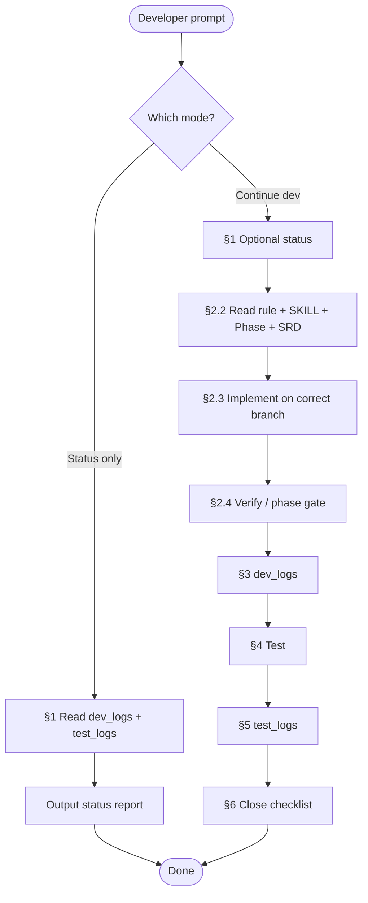

# KuCuba — Standard Operating Procedure (SOP) Blueprint

**Purpose:** One document that tells humans and AI **exactly what to read, in what order, and what to produce** — so you do not repeat folder paths and rules in every chat.

**Use this file as the default entry point** before any implementation session.

---

## 0. Copy-paste prompts (for developers)

Give the AI **one** of these short prompts instead of listing every file.

### A — Where are we now? (read-only status)

```text
Follow docs/SOP_blueprint.md §1 (Status analysis).
Analyze the current state of development from docs/dev_logs/ (all branches: dev0, dev1, dev2) and docs/test_logs/.
Summarize: what is done, what is in progress, what is blocked, and the recommended next step.
Do not write code yet.
```

### B — Continue building the next feature

```text
Follow docs/SOP_blueprint.md end-to-end (§1 then §2–§6).
Read docs/SOP_blueprint.md and continue developing the next feature according to our git branch and phase gates.
```

Optional: add scope, e.g. `Branch: dev2. Target: Phase 2 share overlay only.`

### C — Backend-only session

```text
Follow docs/SOP_blueprint.md. Branch: dev0 (or dev1).
Use docs/AI/backend_dev.md scope. Implement the next backend sector, then complete §4–§6 (dev log + tests + test log).
```

### D — Test & document only

```text
Follow docs/SOP_blueprint.md §5 and §6 only.
Run verification for [Phase 1 / Phase 2 / backend] and write results to docs/test_logs/.
```

---

## 1. Status analysis procedure (before coding)

Run this when the team asks **“where are we?”** or before picking the next task.

### 1.1 Read order

| Step | What to read | Why |
|------|----------------|-----|
| 1 | [`docs/dev_logs/README.md`](dev_logs/README.md) | Branch folder rules (`dev0`/`dev1` = backend, `dev2` = frontend) |
| 2 | **All** logs under [`docs/dev_logs/dev0/`](dev_logs/dev0/), [`dev1/`](dev_logs/dev1/), [`dev2/`](dev_logs/dev2/) | Newest dated files first; skim `small_patches.md` if present |
| 3 | [`docs/test_logs/`](test_logs/) (all `.md` files, newest first) | What was formally tested and passed/failed |
| 4 | [`docs/TECH_STACK_AND_PIPELINE.md`](TECH_STACK_AND_PIPELINE.md) §1 (implementation status) | Planned vs implemented at repo level |
| 5 | Quick scan of **code reality** (only if logs are stale): `backend/`, `lib/`, `android/` | Confirm logs match the tree |

### 1.2 Status report template (AI must output this shape)

```markdown
## KuCuba development status — YYYY-MM-DD

### Branch logs reviewed
- dev0: [summary]
- dev1: [summary]
- dev2: [summary]

### Completed (evidence)
- Backend: …
- Frontend: …
- Tests recorded: …

### In progress / partial
- …

### Not started (per phase plans)
- Phase 1: …
- Phase 2: …
- Phase 3: …

### Blockers & risks
- …

### Recommended next step
- **Branch:** dev0 | dev1 | dev2
- **Phase:** 1 | 2 | 3
- **Task:** one concrete deliverable
- **Read next:** Phase_X doc + rule.md sections …
```

### 1.3 How to infer “what’s next”

| Signal | Next action |
|--------|-------------|
| Backend logs show pipeline done; test_logs validate `/analyze` | Frontend Phase 1 on **dev2** (if `lib/` still template) |
| Phase 1 **backend** gate not passing | Finish backend + `/analyze` tests before Phase 2 **or** Phase 3 |
| Phase 1 backend done; Phase 2 not started | Phase 2 share overlay on **dev2** (if assigned) |
| Phase 1 backend done; Phase 3 not started | Phase 3 notification service on **dev2** (may run **in parallel** with Phase 2) |
| Phase 2 and Phase 3 both in progress | OK — coordinate `android/` manifest merges; both use same backend |
| Conflicting logs between dev0 and dev1 | Note conflict; do not merge branches in docs — report to team |

---

## 2. Full development SOP (implement next feature)

Execute **§1** first unless the user explicitly skips status analysis.

### 2.1 Confirm context

| Check | Action |
|-------|--------|
| Git branch | `dev0` / `dev1` → backend only; `dev2` → frontend only |
| Phase | Phase 1 **backend** first; Phase 2 & 3 may run **in parallel** after (`rule.md` §0.1) |
| Hackathon time | Phase 3 is stretch — skip if &lt; 8 hours remain; does **not** require Phase 2 done |

### 2.2 Mandatory reads (implementation)

Read in this order. **Do not code** until step 4 is done.

| # | Document | Path |
|---|----------|------|
| 1 | **Guardrails** | [`docs/AI/rule.md`](AI/rule.md) — full file, focus on sections for your phase |
| 2 | **Skills / commands** | [`docs/AI/SKILL.md`](AI/SKILL.md) — stack, build order, gates |
| 3 | **Phase plan** (pick one) | [`docs/Phase_1_Core_App_Module.md`](Phase_1_Core_App_Module.md) |
|   | | [`docs/Phase_2_OS_Share_Sheet_Overlay.md`](Phase_2_OS_Share_Sheet_Overlay.md) |
|   | | [`docs/Phase_3_Pinned_Notification_Banner.md`](Phase_3_Pinned_Notification_Banner.md) |
| 4 | **System requirements** | [`docs/Detailed_System_Requirement_Document.md`](Detailed_System_Requirement_Document.md) — at least §1 Architecture + FRs for your phase |
| 5 | **Architecture map** (if integrating) | [`docs/TECH_STACK_AND_PIPELINE.md`](TECH_STACK_AND_PIPELINE.md) |
| 6 | **Backend-only extra** | [`docs/AI/backend_dev.md`](AI/backend_dev.md) when working under `backend/` |

> **Note:** Phase plans live in **`docs/`**, not `docs/AI/`. The `docs/AI/` folder holds **rules and skills** only.

### 2.3 Implement

| Branch | Allowed paths | Forbidden without explicit ask |
|--------|---------------|--------------------------------|
| `dev0`, `dev1` | `backend/`, `backend/.env.example` | `lib/`, `android/` (frontend) |
| `dev2` | `lib/`, `android/`, root `pubspec.yaml` | Changing backend pipeline contract without coordinating |

**Rules while coding:**

- Minimal diff; no scope creep (`rule.md` §0).
- One backend route: `POST /analyze` only.
- Pipeline order: Regex URLs → Safe Browsing → Gemini (never reorder).
- API keys only in `backend/.env` — never commit.
- Do not log `text_payload` to disk or console.

### 2.4 Verify before claiming “done”

Run checks for your layer, then phase gate if applicable.

**Backend (`dev0` / `dev1`):**

```bash
cd backend && dart pub get && dart analyze
dart run bin/server.dart
# smoke test — see SKILL.md curl example
```

**Frontend (`dev2`):**

```bash
flutter pub get
flutter analyze
flutter build apk --debug
# manual: mock mode, then live backend if ready
```

**Phase gates:** checklists in [`docs/AI/rule.md` §11](AI/rule.md) (Phase 1 / 2 / 3).

---

## 3. Document the work (dev_logs)

**When:** Immediately after a meaningful coding session — same PR/session, not “later.”

| Change size | Where |
|-------------|--------|
| Large (new module, major feature, long debug) | `docs/dev_logs/<branch>/YYYY-MM-DD_<topic>.md` |
| Small (few lines, quick fix) | Append top of `docs/dev_logs/<branch>/small_patches.md` |

| Branch folder | Who |
|---------------|-----|
| `docs/dev_logs/dev0/` | Backend developer on `dev0` |
| `docs/dev_logs/dev1/` | Backend developer on `dev1` |
| `docs/dev_logs/dev2/` | Frontend developer on `dev2` |

**Dev log must include:** date, branch, goal, files touched, what/why, debug notes, verification commands.

**Never include:** API keys, `.env` values, full user messages / clipboard text.

Details: [`docs/dev_logs/README.md`](dev_logs/README.md) and `rule.md` §12.

---

## 4. Test (manual + system)

**When:** After implementation and dev_log draft; before marking a phase complete.

| Type | What to do |
|------|------------|
| **Manual** | Run app or curl scenarios from the phase plan; edge cases (empty input, malicious URL, benign text) |
| **System / API** | Backend: `POST /analyze` with known payloads; compare `risk_score` / `analysis_message` |
| **Regression** | Re-run prior phase gate items if your change could break them |

Record **pass/fail** with steps to reproduce failures.

---

## 5. Document tests (test_logs)

**When:** After test pass (or after test fail — document failures too).

| Item | Rule |
|------|------|
| Location | `docs/test_logs/` |
| Naming | `YYYY-MM-DD_<scope>.md` or descriptive title |
| Header | Date, **branch**, engineer, phase/backend/frontend scope |
| Body | Environment, cases, expected vs actual, gate checklist |

Details: [`docs/test_logs/README.md`](test_logs/README.md).

**Do not** put secrets or full `text_payload` in test logs.

---

## 6. Session close checklist

Before ending the chat or PR:

- [ ] Code matches phase plan + `rule.md`
- [ ] `dart analyze` / `flutter analyze` (as applicable) — zero errors
- [ ] Dev log written under **correct** `docs/dev_logs/<branch>/`
- [ ] Tests run; **test log** updated in `docs/test_logs/` if gate-level or formal run
- [ ] Status summary for user: what was done, what’s next (one paragraph)

---

## 7. Document map (everything in one place)

### 7.1 “What do I read?”

```
docs/SOP_blueprint.md          ← YOU ARE HERE (workflow)
docs/AI/rule.md                ← Mandatory guardrails
docs/AI/SKILL.md               ← Stack, commands, build order
docs/AI/backend_dev.md         ← Backend-only agent brief
docs/Phase_1_*.md              ← Phase 1 implementation plan
docs/Phase_2_*.md              ← Phase 2 implementation plan
docs/Phase_3_*.md              ← Phase 3 implementation plan
docs/Detailed_System_Requirement_Document.md  ← SRD / FRs / NFRs
docs/TECH_STACK_AND_PIPELINE.md  ← Stack, API, pipeline diagram
docs/dev_logs/                 ← Per-branch implementation history
docs/test_logs/                ← Formal test reports
```

### 7.2 Phase → primary doc

| Phase | Primary plan | Typical branch | Delivers |
|-------|----------------|----------------|----------|
| **1** | `Phase_1_Core_App_Module.md` | `dev0`/`dev1` backend + `dev2` Flutter | Sandbox UI, meter, `POST /analyze`, mock/live API |
| **2** | `Phase_2_OS_Share_Sheet_Overlay.md` | `dev2` | Share sheet, overlay, auto-analyze (parallel with Phase 3 OK) |
| **3** | `Phase_3_Pinned_Notification_Banner.md` | `dev2` (+ Kotlin) | Foreground service, notification → `POST /analyze` (parallel with Phase 2 OK) |

**Dependency reminder:** Both Phase 2 and Phase 3 require Phase 1 **backend** only. Phase 3 does **not** require Phase 2. See `rule.md` §0.1.

### 7.3 Escalation (stop and ask the team)

Do not silently workaround — see `rule.md` §13 and `SKILL.md` “Escalation”:

- Share intent not receiving text
- Clipboard blocked on target Android
- Gemini non-JSON
- APK build fails after phase work
- `risk_score` nonsense on benign input

---

## 8. Visual workflow



---

## 9. Anti-patterns (do not do this)

| Anti-pattern | Why |
|--------------|-----|
| Skip `dev_logs` and jump straight to Phase 2 code | You lose track of what’s actually merged |
| Read only `docs/AI/` and ignore Phase markdown | Phase plans are not in `AI/` |
| Log backend work under `dev2/` or frontend under `dev0/` | Breaks per-developer history |
| Block Phase 3 because Phase 2 is unfinished | Incorrect — they are parallel after backend is ready |
| Start Phase 2 or 3 before `POST /analyze` works | Forbidden — Phase 1 backend foundation first |
| Repeat full file paths in every user message | Use this SOP + short prompts §0 |

---

*KuCuba — Everywhere Scam Detector (Be U by Bank Islam) | SOP version: 2026-05-23 (Phase 2 ∥ Phase 3 after backend)*
