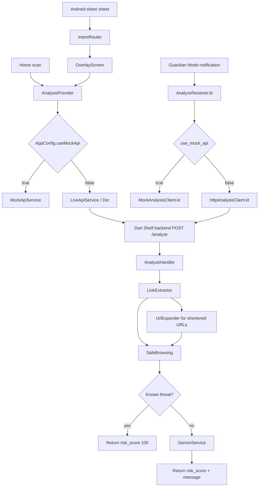

# Tech Stack and System Pipeline

**Project:** Eternal Guardian  
**Package:** `eternal_guardian` / `com.kucuba.eternal_guardian`  
**Backend package:** `kucuba_backend`  
**Status:** Development complete / demo-ready prototype  
**Last updated:** 2026-05-24

## 1. Implementation Status

| Layer | Status | Main locations |
|-------|--------|----------------|
| Flutter app | Implemented | `lib/` |
| Android share-sheet overlay | Implemented | `lib/screens/intent_router.dart`, `lib/screens/overlay_screen.dart`, `android/app/src/main/AndroidManifest.xml` |
| Guardian Mode notification | Implemented | `lib/services/notification_service_controller.dart`, `android/app/src/main/kotlin/com/kucuba/eternal_guardian/` |
| Dart backend | Implemented | `backend/` |
| Safe Browsing integration | Implemented | `backend/lib/services/safe_browsing.dart` |
| Gemini integration | Implemented | `backend/lib/services/gemini_service.dart` |
| Short URL expansion | Implemented | `backend/lib/services/url_expander.dart` |
| Mock/demo mode | Implemented | `lib/services/mock_api_service.dart`, `MockAnalysisClient.kt` |

## 2. Technology Stack

| Area | Technology | Notes |
|------|------------|-------|
| Mobile UI | Flutter / Dart | Android MVP |
| State management | Provider | `AnalysisProvider`, `StatsProvider` |
| Flutter HTTP client | Dio | Live API service |
| Share intent handling | `receive_sharing_intent` | Git dependency pinned in `pubspec.yaml` |
| Notification permission | `permission_handler` | Required before Guardian Mode starts |
| Native Android | Kotlin | Foreground service, notification `RemoteViews`, direct HTTP client |
| Backend API | Dart Shelf + `shelf_router` | Single route: `POST /analyze` |
| Backend HTTP client | Dio | Safe Browsing and URL expansion |
| AI analysis | `google_generative_ai` | Default model: `gemini-2.5-flash-lite` |
| Environment config | `dotenv` | Backend `.env` only |
| UI theme | Bank Islam-inspired red theme, Poppins typography | `lib/theme/` |
| Tests | Flutter tests, Dart analyzer, Android debug build, documented manual checks | `test/`, `docs/test_logs/` |

## 3. Repository Map

```text
KuCuba_Project/
|-- lib/
|   |-- app.dart
|   |-- main.dart
|   |-- config/
|   |-- models/
|   |-- providers/
|   |-- screens/
|   |-- services/
|   |-- theme/
|   `-- widgets/
|-- android/
|   `-- app/src/main/
|       |-- AndroidManifest.xml
|       |-- kotlin/com/kucuba/eternal_guardian/
|       `-- res/layout/notification_*.xml
|-- backend/
|   |-- bin/server.dart
|   `-- lib/
|       |-- handlers/
|       |-- models/
|       `-- services/
|-- resources/
|-- test/
`-- docs/
```

## 4. End-to-End Pipeline



## 5. Backend Analysis Flow

The backend processing order is fixed:

1. Parse and validate request JSON.
2. Extract URLs from the full text payload.
3. Start Safe Browsing checks for original URLs.
4. Expand shortened URLs with max 3 redirects and tight timeouts.
5. Check expanded destinations with Safe Browsing.
6. Return a Safe Browsing result immediately if a threat is found.
7. Call Gemini only when no known threat is found.
8. Clamp Gemini score to `1-100`.
9. Raise unresolved shortened links to at least the caution range.
10. Return JSON with `risk_score`, `analysis_message`, and `analysis_source`.

Safe Browsing and URL expansion use 10-minute in-memory caches to speed repeated test/demo cases. Cache state is process-local and resets when the backend restarts.

## 6. API Contract

### Endpoint

```http
POST /analyze
Content-Type: application/json
```

### Request

```json
{
  "text_payload": "Suspicious message, conversation, or URL"
}
```

### Response

```json
{
  "risk_score": 42,
  "analysis_message": "Short explanation in at most two sentences.",
  "analysis_source": "gemini"
}
```

Clients should treat `risk_score < 0` as unavailable. `analysis_source` is currently used for transparency and logs; clients can ignore it.

## 7. Runtime Configuration

### Flutter

`lib/config/app_config.dart`

| Setting | Purpose |
|---------|---------|
| `useMockApi` | `true` uses local mock responses; `false` calls the backend. |
| `API_BASE_URL` | Optional `--dart-define` override for physical-device backend testing. |

Default live backend URL from Android emulator:

```text
http://10.0.2.2:8080
```

### Backend

`backend/.env`

```env
GEMINI_API_KEY=your_gemini_key
GEMINI_MODEL=gemini-2.5-flash-lite
SAFE_BROWSING_API_KEY=your_safe_browsing_key
```

`SAFE_BROWSING_API_KEY` may be empty for fallback testing. If `GEMINI_API_KEY` is empty, the backend returns an unavailable sentinel instead of calling Gemini.

## 8. Run Commands

Install Flutter dependencies:

```bash
flutter pub get
```

Run backend:

```bash
cd backend
dart pub get
dart run bin/server.dart
```

Run Flutter app:

```bash
flutter run
```

Build Android debug APK:

```bash
flutter build apk --debug
```

Run tests:

```bash
flutter test
flutter analyze lib test
cd backend && dart analyze
```

## 9. Security and Privacy Notes

| Topic | Decision |
|-------|----------|
| API keys | Stored only in `backend/.env`; never in Flutter or Android native code. |
| User payloads | Not persisted and not intentionally logged. |
| Scan history | Out of scope for MVP. |
| Safe Browsing failure | Fail-open to Gemini to preserve availability. |
| Gemini failure | Return `risk_score: -1` and show an error state. |
| Local HTTP | Android cleartext traffic is enabled for development backend testing. |

## 10. Verification

Testing evidence is in [test_logs/](test_logs/). The final pass covered backend validation, optimization checks, UI overflow/contrast, widget tests, notification runtime checklist, and Android debug build validation.
