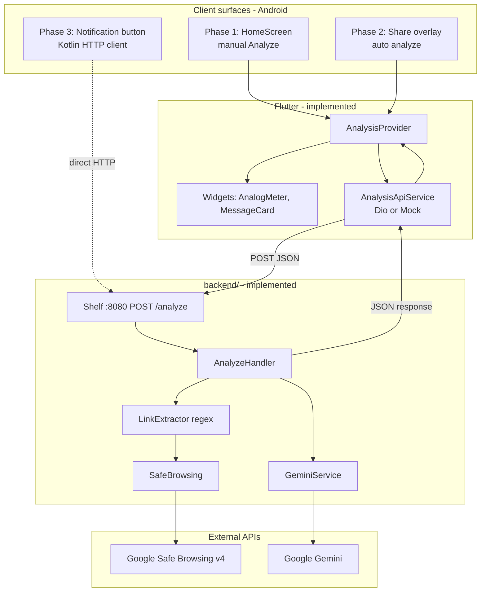
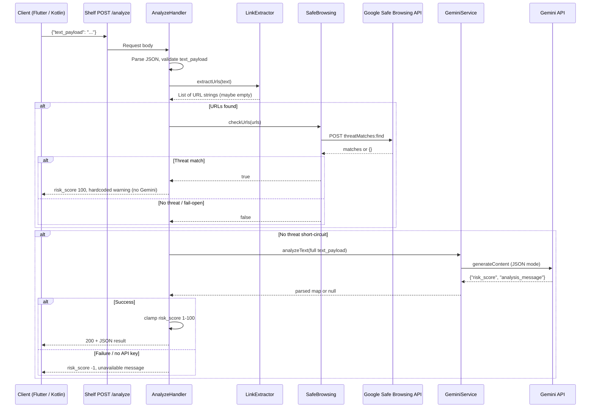
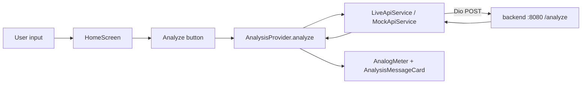
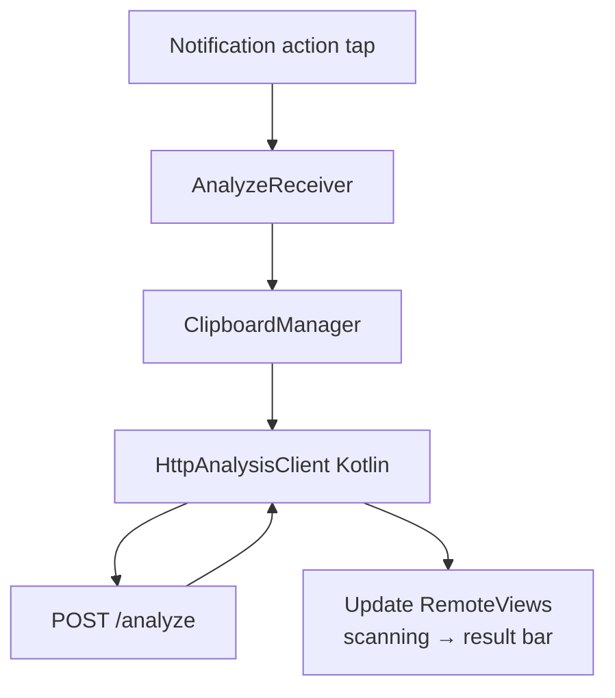

# KuCuba — Tech Stack & System Pipeline

**Project:** Everywhere Scam Detector (Bank Islam “Be U” module)  
**Package:** `eternal_guardian` (`com.kucuba.eternal_guardian`)  
**Platform:** Android MVP (Flutter + native Kotlin where required)

This document describes **what technologies the project uses**, **how components connect**, **who calls whom**, and **what each layer returns**. It reflects the repo after Phase 1 backend completion and unified Flutter client wiring (Phase 1 sandbox + Phase 2 share overlay).

---

## 1. Implementation status (at a glance)

| Layer | Status | Location |
|--------|--------|----------|
| **Backend** (Shelf + hybrid pipeline) | **Implemented** | `backend/` |
| **Flutter app** (UI, Provider, Dio) | **Implemented** (Phase 1 layout + unified API layer) | `lib/` |
| **Phase 2** (OS share sheet overlay) | **Implemented** (`IntentRouter`, `OverlayScreen`) | `lib/screens/` |
| **Phase 3** (pinned notification + Kotlin service) | **Stretch / planned** (may parallel Phase 2) | `docs/Phase_3_Pinned_Notification_Banner.md` |

The **single API contract** (`POST /analyze`) is live on the backend. All client surfaces (sandbox app, share overlay, notification button) call the same endpoint with the same JSON. **Phase 2 and Phase 3 are independent** and may be implemented in parallel once the backend is verified (`docs/AI/rule.md` §0.1).

---

## 2. Tech stack

### 2.1 Languages & runtimes

| Area | Technology | Version / notes |
|------|------------|----------------|
| Mobile UI | **Flutter** (Dart) | SDK `^3.11.0` (root `pubspec.yaml`) |
| Backend API | **Dart** (Shelf HTTP server) | SDK `^3.6.0` (`backend/pubspec.yaml`) |
| Native Android (Phase 3) | **Kotlin** | Foreground service, `RemoteViews`, `HttpURLConnection` |
| Build (Android) | **Gradle Kotlin DSL** | `android/app/build.gradle.kts` |

### 2.2 Flutter dependencies (planned — Phase 1+)

Defined in `docs/Phase_1_Core_App_Module.md` and `docs/AI/rule.md` (root `pubspec.yaml`):

| Package | Role |
|---------|------|
| `provider` | App-wide state (`AnalysisProvider`) |
| `dio` | HTTP client → `POST /analyze` |
| `google_fonts` | Poppins typography |
| `flutter_animate` | UI micro-animations |
| `receive_sharing_intent` | Phase 2: `ACTION_SEND` text capture |

**Mock mode:** `AppConfig.useMockApi` switches `MockApiService` vs `LiveApiService` only in `main.dart` (no backend required for demos).

### 2.3 Backend dependencies (implemented)

| Package | Role |
|---------|------|
| `shelf` + `shelf_router` | HTTP server, routing |
| `http` | Google Safe Browsing REST client |
| `dotenv` | Load `GEMINI_API_KEY`, `SAFE_BROWSING_API_KEY` from `.env` |
| `google_generative_ai` | Gemini SDK |

### 2.4 External services (cloud APIs)

| Service | Called by | Purpose |
|---------|-----------|---------|
| **Google Safe Browsing API v4** | `SafeBrowsing.checkUrls()` | Rule-based URL threat lookup (before LLM) |
| **Google Gemini API** | `GeminiService.analyzeText()` | Few-shot scam analysis when Safe Browsing does not short-circuit |

Keys live only in `backend/.env` (see `backend/.env.example`). The Flutter app never holds Gemini or Safe Browsing keys.

### 2.5 Branding & assets

| Resource | Location |
|----------|----------|
| Bank Islam theme JSON | `resources/bank_islam_theme.json` |
| Logo reference | `resources/Bank-Islam-LOGO_small.png` |
| Canonical colors (planned Flutter) | `lib/theme/app_colors.dart` (per Phase 1 plan) |

---

## 3. Repository layout (logical map)

```
KuCuba_Project/
├── lib/                    # Flutter app (client)
├── android/                # Android manifest, MainActivity, Phase 3 Kotlin (planned)
├── backend/                # Dart Shelf server — analysis pipeline
│   ├── bin/server.dart     # Entry: 0.0.0.0:8080, CORS, wires services
│   └── lib/
│       ├── handlers/analyze_handler.dart
│       ├── services/       # link_extractor, safe_browsing, gemini_service
│       └── models/analysis_result.dart
├── resources/              # Brand reference (not runtime wiring yet)
└── docs/
    ├── AI/                 # rule.md, SKILL.md, backend_dev.md
    ├── Phase_*.md          # implementation plans
    ├── dev_logs/           # per-branch dev/debug notes
    │   ├── README.md
    │   ├── dev0/           # branch dev0 — backend (developer 1)
    │   ├── dev1/           # branch dev1 — backend (developer 2)
    │   └── dev2/           # branch dev2 — frontend
    └── test_logs/          # formal test run logs
```

---

## 4. High-level system architecture

Hybrid **rule-based + AI** design: cheap, fast URL checks first; LLM only when needed (latency target &lt; 2.5s, token cost control).



---

## 5. The analysis pipeline (backend — source of truth)

**Order is fixed** and must not be reordered: **Regex → Safe Browsing → Gemini**.

Implemented in `AnalyzeHandler.handle()` (`backend/lib/handlers/analyze_handler.dart`).



### 5.1 Step-by-step responsibilities

| Step | Component | Input | Output / behavior |
|------|-----------|--------|-------------------|
| **0** | `AnalyzeHandler` | HTTP body | Validates `text_payload`; malformed/empty → error sentinel |
| **1** | `LinkExtractor` | Full message text | `List<String>` URLs (`http://`, `https://`, `www.`) |
| **2** | `SafeBrowsing` | URL list | `true` if any match → **stop**; `false` if clear, no key, or API error (**fail-open**) |
| **3** | `GeminiService` | Full `text_payload` (unchanged text) | JSON map with `risk_score` + `analysis_message`; only if step 2 did not flag |

### 5.2 Short-circuit rules (who responds without calling Gemini)

| Condition | Responder | `risk_score` | `analysis_message` |
|-----------|-----------|--------------|---------------------|
| Safe Browsing reports a threat | `AnalyzeHandler` (hardcoded) | **100** | Link flagged as malicious (phishing/malware) |
| Empty/malformed request | `AnalyzeHandler` | **-1** | Analysis temporarily unavailable |
| Gemini missing key, null response, or parse error | `AnalyzeHandler` | **-1** | Same unavailable message |
| Success after Gemini | `AnalyzeHandler` (clamped) | **1–100** | From model (max ~2 sentences per prompt) |

**Cost rule:** If step 2 returns a threat, step 3 is **never** invoked.

### 5.3 Safe Browsing call details

- **Endpoint:** `https://safebrowsing.googleapis.com/v4/threatMatches:find?key={SAFE_BROWSING_API_KEY}`
- **Method:** `POST` with JSON body (`client`, `threatInfo` with `MALWARE`, `SOCIAL_ENGINEERING`, `UNWANTED_SOFTWARE`)
- **Implementation:** `backend/lib/services/safe_browsing.dart`
- **Fail-open:** Non-200, network errors, or empty API key → treat as no threat and continue to Gemini

### 5.4 Gemini call details

- **Model (code):** `gemini-2.5-flash` (`backend/lib/services/gemini_service.dart`)
- **Config:** `temperature: 0.1`, `responseMimeType: application/json`
- **Prompt:** Few-shot system instruction (5 Malaysian scam + 5 safe examples) — same content as Phase 1 §2.5
- **User content:** Entire `text_payload` string
- **Expected model output:** `{"risk_score": <int>, "analysis_message": "<string>"}`

### 5.5 Server middleware chain

`backend/bin/server.dart` builds:

1. `logRequests()` — request logging  
2. `corsMiddleware()` — `OPTIONS` + `Access-Control-Allow-*` for Flutter dev  
3. `Router` — **only** `POST /analyze`

Listen address: **`0.0.0.0:8080`**.

---

## 6. API contract (all layers)

Single REST surface between every client and the backend.

### 6.1 Request

```http
POST /analyze HTTP/1.1
Host: <backend-host>:8080
Content-Type: application/json

{"text_payload": "<user message or conversation block>"}
```

### 6.2 Success / business response body

Always **HTTP 200** with JSON (errors use sentinel score, not 5xx):

```json
{
  "risk_score": 42,
  "analysis_message": "Short explanation in at most two sentences."
}
```

| `risk_score` | Meaning | UI treatment (planned) |
|--------------|---------|-------------------------|
| 1–30 | Low risk | Green meter zone |
| 31–70 | Caution | Yellow zone |
| 71–100 | High risk | Red zone |
| **100** | Known malicious URL (Safe Browsing) | Red / danger |
| **-1** | Backend/analysis failure | Error banner, no meter |

### 6.3 Data model

Shared shape in `backend/lib/models/analysis_result.dart` (Flutter will mirror in `lib/models/analysis_result.dart` per Phase 1 plan).

---

## 7. Client surfaces — how each connects to the backend

Three **entry points**, one **pipeline**.

### 7.1 Phase 1 — Core app (sandbox)

**User flow:** Paste or type multi-line text → tap **Analyze** → see meter + message.



| Layer | Responsibility |
|-------|----------------|
| `HomeScreen` | Text field, button, idle/loading/complete/error UI |
| `AnalysisProvider` | State machine: `idle` → `loading` → `complete` / `error` |
| `AnalysisApiService` | Abstracts mock vs live; **only** place that knows `useMockApi` |
| `LiveApiService` | Dio → `http://10.0.2.2:8080` (emulator → host machine) |
| `MockApiService` | ~1500ms delay + keyword-based fake scores (demo without backend) |

**Who responds:** Backend JSON drives UI; mock service responds locally without network.

### 7.2 Phase 2 — OS share sheet overlay

**User flow:** WhatsApp/SMS → Share → “Scam Detector” → overlay opens → **automatic** analysis (no Analyze button).

| Piece | Role |
|-------|------|
| `AndroidManifest.xml` | `ACTION_SEND` + `text/plain` on existing `MainActivity` |
| `receive_sharing_intent` | `getInitialMedia()` / `getMediaStream()` → shared text |
| `IntentRouter` | Routes launcher vs overlay |
| `OverlayScreen` | Transparent scaffold, bottom panel, reuses Phase 1 widgets |
| `AnalysisProvider` | Same `analyze()` as Phase 1, triggered in `initState` post-frame |

**Dismissal:** `ReceiveSharingIntent.instance.reset()` + `SystemNavigator.pop()` (not `Navigator.pop`) so the originating app regains focus.

**Who responds:** Same `POST /analyze` as Phase 1; overlay only changes **how text arrives**, not the API.

### 7.3 Phase 3 — Pinned notification (stretch)

**User flow:** Persistent notification → **Analyze Copied Text** → clipboard read → backend → notification UI updates (horizontal risk bar).

| Piece | Role |
|-------|------|
| `ScamDetectorForegroundService` (Kotlin) | Foreground service + `RemoteViews` layouts |
| `AnalyzeReceiver` (Kotlin) | Button `PendingIntent`; reads clipboard |
| `HttpAnalysisClient` (Kotlin) | **Direct** `POST /analyze` — does **not** start Flutter engine |
| `MethodChannel('com.kucuba/notification_service')` | Flutter starts/stops service only |



**Who responds:** Backend JSON consumed in Kotlin for notification UI; Flutter is optional for service lifecycle.

---

## 8. Network topology (development)

| From | To | URL / note |
|------|-----|------------|
| Android **emulator** Flutter app | Host machine backend | `http://10.0.2.2:8080/analyze` |
| Physical device (dev) | Machine LAN IP | Same port `8080`, host IP instead of `10.0.2.2` |
| Phase 3 Kotlin (on device) | Backend | Configured base URL in native client (same JSON contract) |
| Backend | Safe Browsing | `safebrowsing.googleapis.com` |
| Backend | Gemini | Via `google_generative_ai` SDK |

CORS on the backend allows browser/emulator Flutter tooling to call `POST /analyze` during development.

---

## 9. Security, privacy, and logging

| Rule | Implementation |
|------|----------------|
| API keys | Only in `backend/.env`; never in Flutter or git |
| User text | **Not** logged or persisted on disk (backend logs URL counts/paths only, not `text_payload`) |
| Analysis results | Ephemeral — no history DB in scope |
| Safe Browsing failure | Fail-open to Gemini (availability over blocking) |
| Gemini disabled | Returns `risk_score: -1` if no `GEMINI_API_KEY` |

---

## 10. UI ↔ score mapping (planned Flutter)

| Score | Meter color | Label intent |
|-------|-------------|--------------|
| 1–30 | Green (`#2ECC71`) | Safe |
| 31–70 | Yellow (`#F1C40F`) | Caution |
| 71–100 | Red (`#E74C3C`) | Danger |

`AnalogMeter` uses `CustomPainter` (180° arc, animated needle ~1200ms). Phase 3 notification uses a **horizontal segmented bar** instead of the half-circle meter.

---

## 11. Related documentation

| Document | Contents |
|----------|----------|
| `docs/Detailed_System_Requirement_Document.md` | SRD §1 architecture, functional requirements |
| `docs/Phase_1_Core_App_Module.md` | Flutter structure, backend file map, mock mode |
| `docs/Phase_2_OS_Share_Sheet_Overlay.md` | Share intent + overlay UX |
| `docs/Phase_3_Pinned_Notification_Banner.md` | Foreground service + Kotlin bridge |
| `docs/AI/rule.md` | Enforced conventions (Provider, Dio, API contract, phases) |
| `docs/SOP_blueprint.md` | **Start here** — SOP, prompts, read order, session checklist |
| `docs/dev_logs/README.md` | Where each developer logs (`dev0` / `dev1` / `dev2`) |
| `docs/dev_logs/dev0/` | Backend dev logs (developer on branch `dev0`) |
| `docs/dev_logs/dev1/` | Backend dev logs (developer on branch `dev1`) |
| `docs/dev_logs/dev2/` | Frontend dev logs (Flutter, share overlay, UI) |
| `docs/test_logs/` | Validation and phase test results |

---

## 12. Quick reference — “who answers what?”

| Question | Answered by |
|----------|-------------|
| Is this URL a known threat? | **Google Safe Browsing** (via `SafeBrowsing`) → backend may return **100** without Gemini |
| Is this message a scam linguistically? | **Gemini** (via `GeminiService`) → **1–100** + message |
| Demo without backend? | **`MockApiService`** in Flutter |
| Invalid input or server/LLM failure? | **`AnalyzeHandler`** → **-1** + unavailable text |
| Where is the only HTTP route? | **`POST /analyze`** on port **8080** |
| Do share sheet and notification use a different API? | **No** — same body and response schema |

---

*Last aligned with backend Phase 1 sectors 1–3 and Flutter Phase 1 + Phase 2 share overlay (unified `AnalysisProvider` + `AppConfig.useMockApi`). Update when Phase 3 notification banner lands.*
