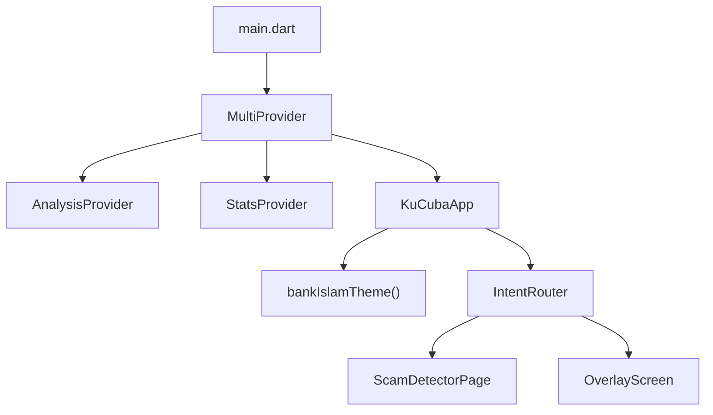
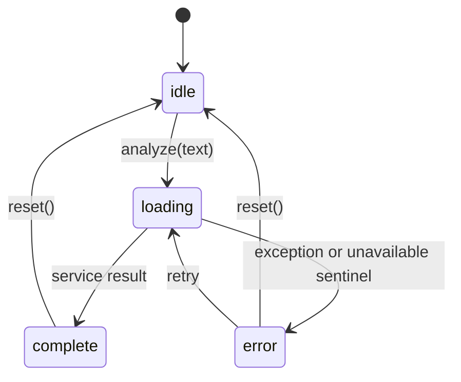

# Flutter UI Architecture

**Project:** Eternal Guardian  
**Status:** Current Android MVP implementation  
**Last updated:** 2026-05-25

## 1. Overview

The Flutter UI is an Android-first scam analysis experience with three user-facing flows:

| Flow | Screen/component | Behavior |
|------|------------------|----------|
| Manual scan | `ScamDetectorPage` | Paste or type text, analyze, view score and explanation. |
| Share-sheet scan | `IntentRouter` + `OverlayScreen` | Receive Android shared text, open overlay, auto-analyze. |
| Guardian Mode | `ScamDetectorPage` + `NotificationServiceController` | Toggle persistent notification service for notification-based checks. |

`main.dart` creates the shared providers, `KuCubaApp` applies the theme, and `IntentRouter` decides whether to show the home flow or the share overlay.

## 2. UI File Map

```text
lib/
|-- app.dart
|-- main.dart
|-- config/
|   `-- app_config.dart
|-- models/
|   |-- analysis_result.dart
|   `-- scam_demo_models.dart
|-- providers/
|   |-- analysis_provider.dart
|   `-- stats_provider.dart
|-- screens/
|   |-- home_screen.dart
|   |-- intent_router.dart
|   `-- overlay_screen.dart
|-- services/
|   |-- api_service.dart
|   `-- notification_service_controller.dart
|-- theme/
|   |-- app_colors.dart
|   |-- app_typography.dart
|   `-- bank_islam_theme.dart
`-- widgets/
    |-- analog_meter.dart
    |-- analysis_message_card.dart
    |-- analyze_button.dart
    |-- error_banner.dart
    |-- risk_badge.dart
    |-- risk_utils.dart
    |-- scam_widgets.dart
    |-- skeleton_meter_placeholder.dart
    `-- text_input_area.dart
```

## 3. App Shell



`main.dart` injects `LiveApiService` into `AnalysisProvider` at startup. If the backend or an external analysis service is unavailable, the provider enters the `error` state and the UI shows `ErrorBanner` with retry instead of rendering a low-risk result.

## 4. Screen Structure

### Home

Implemented in `ScamDetectorPage._buildHomeScreen()`.

Main elements:

| Element | Purpose |
|---------|---------|
| Red branded header | App identity and quick trust signal. |
| Stat cards | In-session count of scans and blocked threats. |
| Quick Scan button | Navigates to the scan screen. |
| Guardian Mode card | Starts/stops the Android foreground notification service. |
| Quick examples | Demo messages that trigger immediate analysis. |
| Share Sheet Demo | Opens the overlay UI using sample text. |
| Bottom nav | Home and Scan navigation. |

### Scan

Implemented in `ScamDetectorPage._buildScanScreen()`.

Main elements:

| Element | Purpose |
|---------|---------|
| Header | Back action and screen title. |
| `TextInputArea` | Multi-line suspicious message input. |
| `AnalyzeButton` | Calls `AnalysisProvider.analyze()`. |
| Paste from Clipboard | Pulls text from Android clipboard into the input field. |

### Result

Implemented in `ScamDetectorPage._buildResultScreen()`.

State-driven content:

| Provider state | UI |
|----------------|----|
| `idle` | Empty content. |
| `loading` | `SkeletonMeterPlaceholder` with staged loading labels. |
| `complete` | `AnalogMeter`, `RiskBadge`, `AnalysisMessageCard`, optional report button. |
| `error` | `ErrorBanner` with retry when input is available. |

When an analysis completes, `StatsProvider.recordAnalysis()` updates scan and threat counters once per result.

### Share Overlay

Implemented in `OverlayScreen`.

Behavior:

| Requirement | Implementation |
|-------------|----------------|
| Analyze automatically | Calls `AnalysisProvider.analyze(widget.sharedText)` after first frame. |
| Stay visually anchored | Uses a bottom-aligned panel occupying 88% of screen height. |
| Avoid accidental dismissal | Scrim has no tap handler and `PopScope` redirects back to `onDismiss`. |
| Reuse core components | Uses the same loading, meter, message, and error widgets as the app flow. |
| Return to source app | `IntentRouter` calls `ReceiveSharingIntent.instance.reset()` and `SystemNavigator.pop()`. |

## 5. State Management

### AnalysisProvider

`AnalysisProvider` owns the analysis state machine:



State fields:

| Field | Purpose |
|-------|---------|
| `state` | `idle`, `loading`, `complete`, or `error`. |
| `result` | Current `AnalysisResult`, when available. |
| `errorMessage` | User-readable error message. |
| `isLoading` | Convenience getter for buttons/loading UI. |

### StatsProvider

`StatsProvider` tracks in-session statistics shown on the home screen. It is intentionally local-only for the MVP.

## 6. Service Layer

| Service | Responsibility |
|---------|----------------|
| `LiveApiService` | Sends Dio `POST /analyze` requests to `AppConfig.backendBaseUrl` with the app-secret header. |
| `NotificationServiceController` | Uses a MethodChannel to start, stop, and query the native foreground service. |

`LiveApiService` treats backend sentinel results (`risk_score < 0`), failed HTTP responses, network errors, timeouts, and malformed responses as `AnalysisUnavailableException`, allowing the UI to show a clean error state instead of a low-risk result.

## 7. Visual System

| Token/source | Usage |
|--------------|-------|
| `AppColors.corporateRed` | Primary action and brand color. |
| `AppColors.background` | Main app and overlay panel background. |
| `AppColors.surfaceCard` | Cards and preview surfaces. |
| `bankIslamTheme()` | Material theme, Poppins typography, component styling. |

Risk visualization:

| Risk range | Label | Color intent |
|------------|-------|--------------|
| `1-30` | Safe / Low risk | Green |
| `31-70` | Caution | Yellow / amber |
| `71-100` | Danger / High risk | Red |
| `<0` | Unavailable | Error state, no meter |

## 8. Reusable Widgets

| Widget | Purpose |
|--------|---------|
| `AnalogMeter` | Animated half-circle score meter; supports compact overlay mode. |
| `AnalysisMessageCard` | Presents the explanation using risk-aware styling. |
| `AnalyzeButton` | Full-width action button with loading/disabled behavior. |
| `ErrorBanner` | Error state and retry affordance. |
| `RiskBadge` | Compact score label. |
| `SkeletonMeterPlaceholder` | Staged loading state for manual and overlay flows. |
| `TextInputArea` | Multi-line input surface. |
| `BottomNavBar` / `GlassStatCard` | Home screen support components. |

## 9. Android UI Integration

Guardian Mode is split between Flutter and native Android:

| Layer | Responsibility |
|-------|----------------|
| Flutter home screen | Shows switch, requests notification permission, calls MethodChannel. |
| `MainActivity.kt` | Receives MethodChannel calls and starts/stops the service. |
| `ScamDetectorForegroundService.kt` | Owns the persistent foreground notification. |
| `NotificationHelper.kt` | Builds idle, scanning, result, and error `RemoteViews`. |
| `AnalyzeReceiver.kt` | Receives notification input and runs analysis on a background thread. |

## 10. Testing Focus

UI validation should prioritize:

| Area | What to check |
|------|---------------|
| Text overflow | Home, result, overlay, and notification labels on small screens. |
| Loading state | Staged labels appear quickly and do not shift layout. |
| Share overlay | Shared text is truncated safely and auto-analysis runs once. |
| Production API mode | App and notification flows call the configured backend and show retryable errors if unavailable. |
| Error handling | Backend unavailable cases show actionable messages. |
| Android notification | Physical-device behavior for permission, foreground service, and RemoteInput. |

Testing evidence is stored in [test_logs/](test_logs/).
